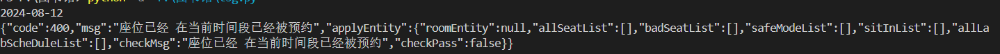
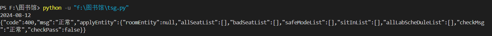
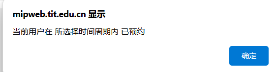
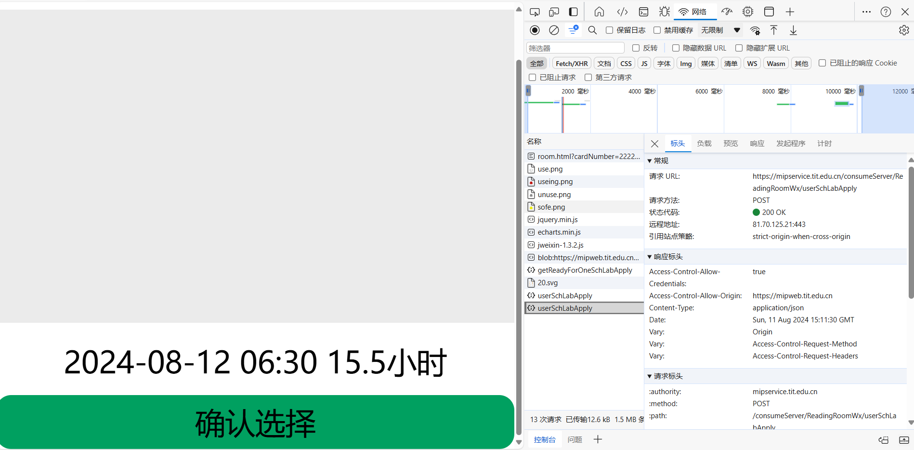
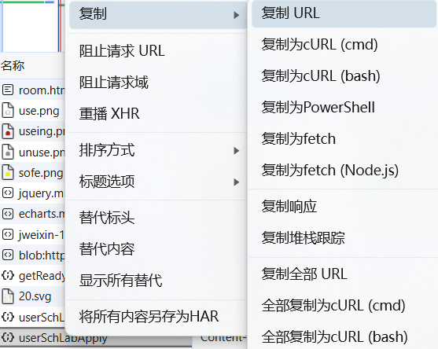
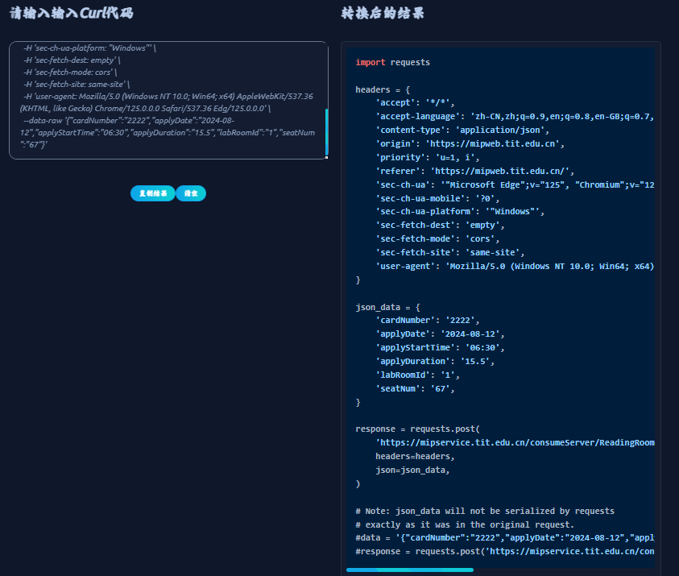

# 太原某学院图书馆自动约座
- [太原某学院图书馆自动约座](#太原工业学院图书馆自动约座)
  - [方法一](#方法一)
  - [方法二](#方法二)
    - [馆号](#馆号)
- [方法一操作:](#方法一操作)
  - [1.购买、配置vps或者使用自己电脑](#1购买配置vps或者使用自己电脑)
  - [2.运行tsg.py文件](#2运行tsgpy文件)
  - [3.测试](#3测试)
- [方法一部分截图](#方法一部分截图)
- [方法二部分截图](#方法二部分截图)
- [实现过程](#实现过程)


## 方法一
每日0点自动约下一天座，需要一台24h或者0点前后开机的vps，具有ipv4公网能力。azure为学生提供每年vps的使用，推荐！！当然，国内阿里云、腾讯云、华为云也可以。
## 方法二
提供网页手动约座，只需要改学号cardNumber=（可任意，也就是说你可以帮其他人约或者虚假学号，甚至汉字都可以，目前没有校验），日期date=（注意必须2带0，比如3月3日就要写03-03），预约时长timeLong=，馆号roomId=，该方式点击确认选择后即可预约，第二次进入提示被预约；
这个是[网站](https://mipweb.tit.edu.cn/schReadingRoomSvg/h5Show/room.html?cardNumber=%E5%AD%A6%E5%8F%B7&date=2024-08-12&time=06:30&timeLong=15.5&roomId=10),自己进行复制，展示出来容易被攻击。
### 馆号
1 二层报刊阅览室
2 三层中文阅览室一
3 三层中文阅览室二
4 三层休闲区
5 四层中文图书馆阅览室三
6 四层中文阅览室四
7 五层外文阅览室
8 五层综合阅览室
9 六层多媒体阅览室
10 六层电子阅览室

# 方法一操作:
## 1.购买、配置vps或者使用自己电脑
使用阿里云、azure、腾讯云、华为云等云服务平台，推荐使用unbuntu系统，其他也可以肯定。当然，自己电脑也可以。前提是0点有网。
使用python，安装schedule、datetime、requests、time库
安装命令：
```
pip install 库名 -i https://pypi.tuna.tsinghua.edu.cn/simple
```
## 2.运行tsg.py文件
首先，试一下配置库是否做好，使用进行测试，修改预约时间为运行的下一分钟，看是否配置正确
```
python tsg.py
```
使用nohup命令对tsg.py进行运行，如果使用电脑的话，也可以每天0点前进行手动运行。
nohup：使用 Xshell 等Linux 客户端工具，远程执行 Linux 脚本时，有时候会由于网络问题，导致客户端失去连接，终端断开，脚本运行一半就意外结束了。这种时候，就可以用nohup 指令来运行指令，即使客户端与服务端断开，服务端的脚本仍可继续运行。
```
nohup python tsg.py >tsg.log&
```
## 3.测试
你可以修改时间进行测试nohup是否运行。使用ps命令查看是否tsg.py文件在后台运行
```
ps -ef | grep python
```
同时会返回一个pid号，使用kill命令可以关闭
```
kill -9 pid
```
# 方法一部分截图
该座位已经被预约，一般来说，没人能抢过这个脚本，当然图书馆系统有时候0点会崩，如果0前崩就预约不了，0点之后就不关你事了


该座位成功被你预约


# 方法二部分截图





# 实现过程
使用游览器抓取请求，如图：


复制curl：


进行转换：[网站](https://trumanwl.com/development/curl/python)


下面就是修改代码等等......
当然，你也可以同时给多人约，只需要增加json_data，requests.post就可以了。
